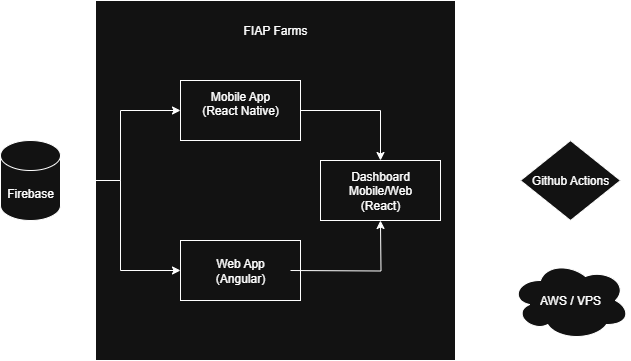

# 🌾 Fiap Farms

[](https://nodejs.org/)
[](https://expo.dev/)
[](https://docs.docker.com/compose/)
[](https://opensource.org/licenses/MIT)

> Aplicação fullstack para visualização e gerenciamento de dados agrícolas. Composta por:
>
> * Um painel web (React + Vite)
> * Um app mobile (Expo + React Native)
> * Um módulo de autenticação (Angular)
> * Backend em Firebase e deploy via GitHub Actions

---

## 🧭 Arquitetura



---

## 📁 Estrutura do Projeto

```
fiap-farms/
├── fiap-farms-dashboard/     # Dashboard Web/Mobile (React + Vite)
├── fiap-farms-mobile/        # Aplicação Mobile (Expo + React Native)
├── fiap-farms-web-login/     # Login Web (Angular + TailwindCSS)
├── scripts/
│   └── get-ip.js             # Detecta o IP local para uso no app mobile
│   └── start.js              # Inicia o app
├── docker-compose.yml        # Orquestra os containers web + mobile + login
└── package.json              # Comando de inicialização unificada
```

---

## 📦 Requisitos

* [Node.js](https://nodejs.org/) `v20.x`
* [Docker](https://www.docker.com/) `v20+`
* [Docker Compose](https://docs.docker.com/compose/) `v2.20+`
* [Expo Go](https://expo.dev/client) instalado no celular

---

## 🧩 Bibliotecas principais

### 🌐 Dashboard (`fiap-farms-dashboard`)

* `React 19`
* `Vite`
* `TailwindCSS`
* `Leaflet`
* `Firebase Auth`
* `React Router DOM`
* `Recharts`

### 📱 Mobile (`fiap-farms-mobile`)

* `Expo SDK 53`
* `React Native 0.79.5`
* `React 19`
* `Expo Router`
* `React Native Paper`
* `Firebase Auth`
* `Expo Go`

### 🔐 Login (`fiap-farms-web-login`)

* `Angular 20.1.0`
* `@angular/common@^20.1.0`
* `Angular Material`
* `TailwindCSS`
* `Firebase Auth`
* `i18n` com `.resx` para múltiplos idiomas (pt-PT, en-US)

---

## 🚀 Como rodar o projeto

### 1. Clone o projeto

```bash
git clone https://github.com/fonaziero/fiap-farms.git
cd fiap-farms
```

### 2. Rode o projeto com IP dinâmico

```bash
npm run start
```

Esse comando irá:

* Gerar um `.env` com o IP da sua máquina local
* Subir os containers:

  * `fiap-farms-dashboard` (porta 5173)
  * `fiap-farms-mobile` (Expo via tunnel)
  * `fiap-farms-web-login` (Angular login, porta configurada no container)

---

## ▶️ Rodando cada projeto individualmente

### Web Login (Angular)

```bash
cd fiap-farms-web-login
npm install
npm start
```

### Mobile (Expo)

```bash
cd fiap-farms-mobile
npm install
npm start
```

### Dashboard (React + Vite)

```bash
cd fiap-farms-dashboard
npm install
npm run dev
```

---

## 📱 Acessando o app Mobile (Expo Go)

1. Abra o app **Expo Go** no seu celular
2. Escaneie o **QR Code** exibido no terminal (após `docker-compose`)
3. O app será carregado remotamente

> 🔸 Importante: celular e computador precisam estar na **mesma rede Wi-Fi**

---

## 🛠️ Scripts úteis

```bash
# Reiniciar containers (caso algo quebre)
docker-compose down && npm run start

# Parar todos os serviços
docker-compose down
```

---

## 🧪 Testes e ambiente

* Testado com:

  * Node.js `v20.11.0`
  * Expo CLI `v7.4.0`
  * Angular `v20.1.0`
  * Expo Go no Android e iOS
  * Navegadores Chrome e Firefox
* Sem necessidade de build nativo (apenas Expo Go)

---

## 🧠 Ideias futuras

* Integração com sensores IoT (umidade, solo)
* Visualização de safra por regiões
* Perfil do agricultor com preferências e histórico

---

## 📄 Licença

MIT © [Victor Fornaziero](https://github.com/fonaziero)

---

## 🐛 Dúvidas ou sugestões?

Abra uma [issue](https://github.com/fonaziero/fiap-farms/issues) ou entre em contato!
